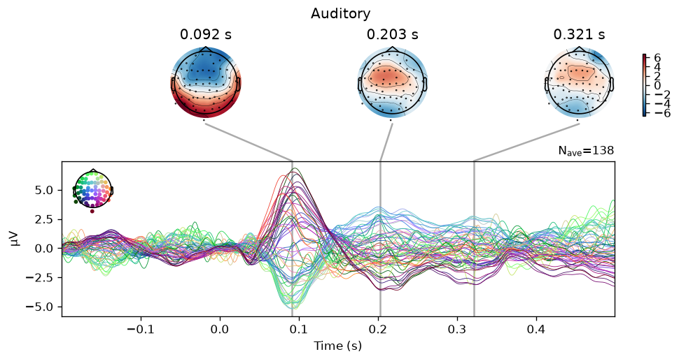
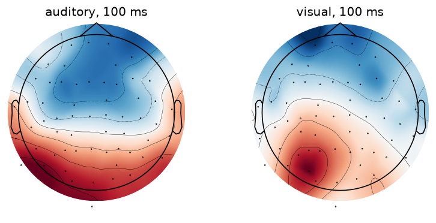
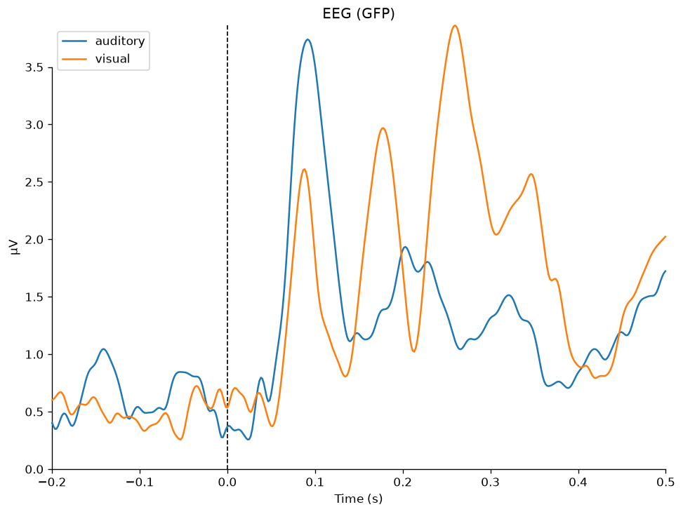
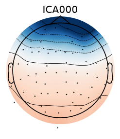
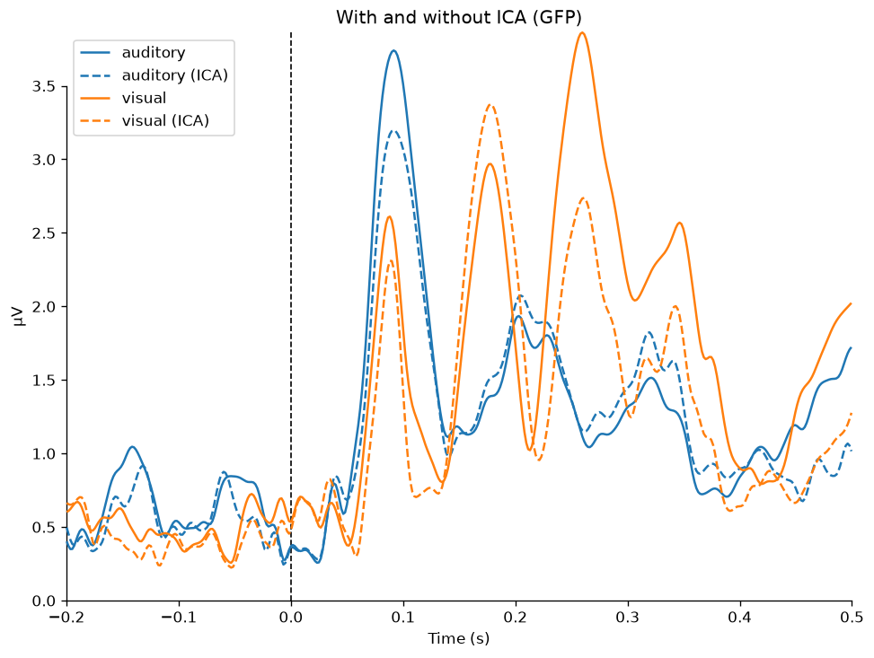
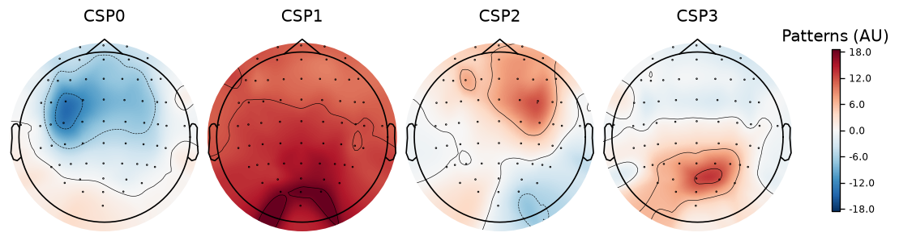
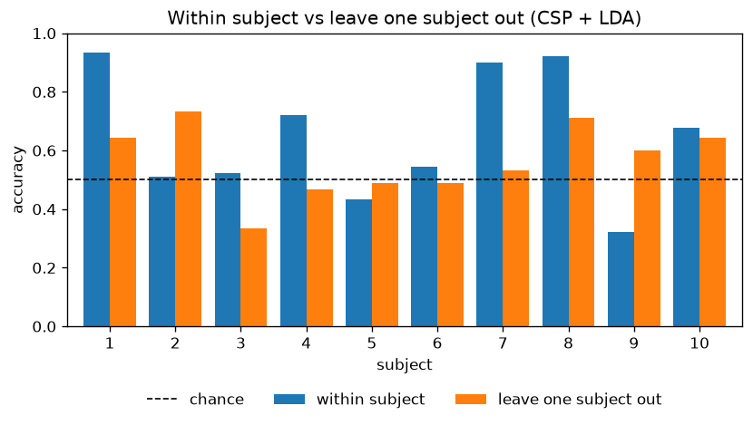

# EEG with MNE-Python

A short self-directed project where I worked through two standard EEG analyses in MNE-Python. The first one turns raw EEG into averaged brain responses (ERPs) to sounds and images. The second one classifies imagined hand vs feet movement from EEG using CSP and LDA, and then checks how well that holds up on people the model has never seen.

The goal wasn't a new result, I just wanted to get my hands on real neural data and understand the usual pipeline end to end.

| Notebook | What it does | Data |
| --- | --- | --- |
| [`01_erp.ipynb`](01_erp.ipynb) | ERP pipeline, preprocessing comparisons, ICA for eye blinks | MNE `sample` (1 subject, 60 channel EEG) |
| [`02_motor_imagery.ipynb`](02_motor_imagery.ipynb) | CSP + LDA decoding, other classifiers, time windows, cross subject test | PhysioNet EEGBCI (subjects 1 to 10, 64 channels) |

## Part 1: ERPs

Load the EEG, average reference, band-pass 0.1 to 40 Hz, cut epochs from -200 to 500 ms around each stimulus, drop noisy trials and average per condition. 278 of 289 trials survived the rejection step.

<p align="center">
  
</p>

The auditory response has a clear N100 at 97 ms over the central/frontal channels, which is where it should be. At the same point in time the visual response is positive over the back of the head, and its biggest peak comes later at around 178 ms.

<p align="center">
  
  
</p>

### Changing the preprocessing

I reran the same pipeline with a few different settings to see what actually moves.

| Setting | Auditory trials | Visual trials | N100 latency | N100 amplitude |
| --- | --- | --- | --- | --- |
| 0.1 to 40 Hz, EEG 150 uV / EOG 250 uV | 138 | 140 | 97 ms | -5.2 uV |
| 1 to 40 Hz, same rejection | 138 | 140 | 92 ms | -5.3 uV |
| 0.1 to 40 Hz, stricter (100 / 150) | 115 | 118 | 93 ms | -4.8 uV |
| 0.1 to 40 Hz, EEG threshold only | 144 | 144 | 97 ms | -5.9 uV |
| 0.1 to 40 Hz, no rejection | 145 | 144 | 97 ms | -6.4 uV |

The high-pass change barely did anything to the trial counts but pulled the N100 about 5 ms earlier. The stricter threshold cost around 25 trials per condition. Almost all the rejections came from the EOG channel, not the EEG.

### ICA for blinks

Instead of throwing away trials with blinks, I fit ICA on a 1 Hz high-passed copy, found the blink component by correlating with the EOG channel (only one, ICA000, and it looks like the typical frontal blob) and removed it.

<p align="center">
  
</p>

| | Auditory | Visual | Total |
| --- | --- | --- | --- |
| No ICA, EEG + EOG rejection | 138 | 140 | 278 |
| ICA, EEG + EOG rejection | 138 | 140 | 278 |
| ICA, EEG rejection only | 145 | 144 | 289 |

At first ICA seemed to do nothing. That's because the EOG channel itself still has the blinks in it (ICA only cleans the EEG channels) so the EOG rule was still dropping the same trials. Once I dropped that rule after ICA every trial was kept.

<p align="center">
  
</p>

The peaks got smaller after ICA though, especially the visual one around 260 ms. Part of that is probably the extra trials adding noise, and part of it is that the blink component also carries some real frontal activity, so removing it takes a bit of signal with it.

## Part 2: Motor imagery decoding

Imagining a movement suppresses the mu and beta rhythms (8 to 30 Hz) over motor cortex. CSP learns spatial filters that separate the two classes by variance, and LDA classifies the log variance of those filtered signals. For subject 1 I used runs 6, 10 and 14 (imagined fists vs feet), band-passed 7 to 30 Hz and took 1 to 2 s after the cue.

**Subject 1 accuracy: 93% (chance is 50%)**, over 10 random 80/20 splits of 45 trials.

<p align="center">
  
</p>

The first pattern sits over the left central area around C3, which is roughly left motor cortex. CSP3 is more central/posterior. CSP1 is spread over the whole head with the strongest part at the back, so I'm not sure that one is really motor activity.

### Other classifiers and time windows

| Model | Accuracy |
| --- | --- |
| CSP + LDA | 0.93 |
| CSP + logistic regression | 0.92 |
| Band power (mu, beta per channel) + logistic regression | 0.62 |
| Band power + gradient boosting | 0.36 |

| Window after cue | Accuracy |
| --- | --- |
| 0 to 1 s | 0.50 |
| 0.5 to 1.5 s | 0.74 |
| 1 to 2 s | 0.93 |
| 0.5 to 2.5 s | 0.98 |
| 1 to 3 s | 0.97 |
| 0.5 to 4 s | 0.98 |

CSP is doing most of the work here. With only 45 trials and 128 band power features, gradient boosting just overfits and ends up below chance, which is not what I'd expect from it on normal tabular data. The first second after the cue is at chance, so the useful signal only shows up after that, and longer windows help.

### Does it work on new people?

Within subject means train and test on the same person. Leave one subject out means train on 9 people and test on the 10th.

<p align="center">
  
</p>

| | Mean accuracy (subjects 1 to 10) |
| --- | --- |
| Within subject | 0.65 |
| Leave one subject out | 0.56 |

It drops a lot, which I expected since every head and electrode placement is a bit different, so each person is basically a new domain. What I didn't expect was how much subjects vary even within subject. 1, 7 and 8 are above 90% but 5 and 9 are below chance on their own data. Subjects 2 and 9 actually did better when trained on other people, probably because 45 trials of their own isn't enough and the pooled data gives the model more to learn from. The obvious next step would be Riemannian methods (`pyriemann`) or re-centering each subject's data, which are the usual fixes for this kind of shift.

## What surprised me

- Adding ICA didn't change anything until I realised the EOG rejection was still looking at an uncleaned channel. And once it did work, the ERP peaks got smaller, so keeping more trials isn't free.
- A fancier model (gradient boosting) did worse than chance on this. With so few trials the feature extraction matters way more than the classifier.
- For some subjects the model trained on other people beat the model trained on themselves.

## Running it

```bash
python -m venv .venv
source .venv/bin/activate        # on Windows: .venv\Scripts\activate
pip install -r requirements.txt
jupyter notebook
```

Both datasets download automatically the first time you run the notebooks. The `sample` dataset is around 1.6 GB so it takes a while. Plots are also saved into `figures/`.

Built with MNE 1.13 and scikit-learn 1.9.
